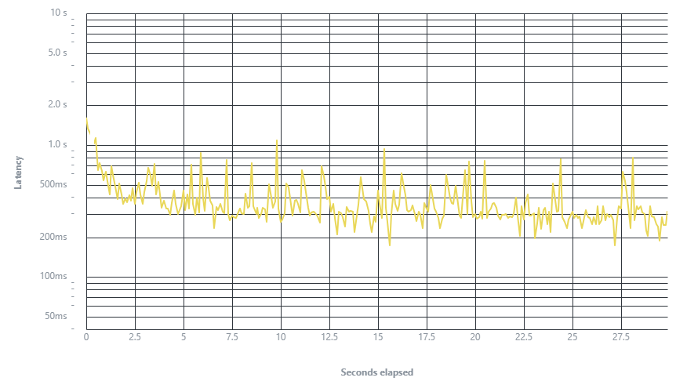
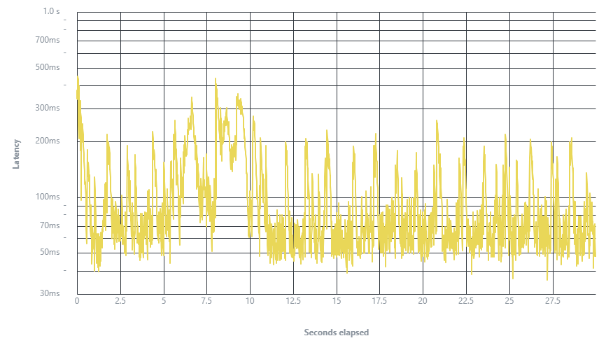
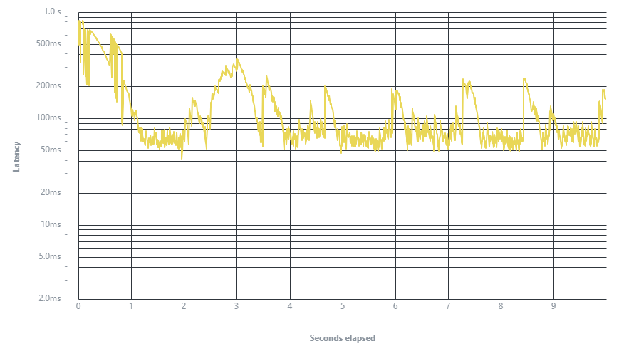

# 🚀 Real-Time Load Testing and Performance Analysis of JSONPlaceholder API Using Vegeta

---

## 👤 Student Information
- 👨‍🎓 Name: Wan Husaini Bin Wan Ibrahim
- 🆔 Matric ID: 2023549553
- 📚 Course: ITT440 / NBCS2555A

---

## 🎯 Objective

This project evaluates the performance of a public REST API under different traffic conditions using a load testing tool.

Objectives:
- 📊 Measure API response time
- ⚙️ Evaluate system performance under load
- 🔥 Analyze stress and spike behavior
- 🧠 Identify performance bottlenecks

---

## 🌐 API Target

🔗 https://jsonplaceholder.typicode.com/posts  

---

## 🛠 Tools Used

- ⚡ Vegeta (HTTP Load Testing Tool)  
- 💻 Windows Command Prompt (CLI)  

---

## 🧪 Test Scenarios

### 📉 Load Test
- 10 requests/second  
- 30 seconds  

### 🔥 Stress Test
- 100 requests/second  
- 30 seconds  

### ⚡ Spike Test
- 200 requests/second  
- 10 seconds  

---

## ⚙️ Methodology

### Step 1: Create targets.txt

Create a file named `targets.txt` and add:

GET https://jsonplaceholder.typicode.com/posts


### Step 2: Run Load Test

```bash id="x1ld91"
vegeta attack -rate=10 -duration=30s -targets=targets.txt > load.bin
vegeta plot load.bin > load.html
```

### Step 3: Run Stress Test

```bash id="x1ld91"
vegeta attack -rate=100 -duration=30s -targets=targets.txt > load.bin
vegeta plot load.bin > load.html
```

### Step 4: Run Spike Test

```bash id="x1ld91"
vegeta attack -rate=200 -duration=10s -targets=targets.txt > load.bin
vegeta plot load.bin > load.html
```

---

## 📊 Results and Observations

### 📉 Load Test



- Stable response time
- No request failures
- System handled normal traffic well

---

### 🔥 Stress Test



- Increased latency observed
- Performance degradation occurred
- System still functional

---

### ⚡ Spike Test



- Sudden latency spikes detected
- Temporary instability observed
- System recovered after load dropped

---

## 🔍 Findings

- ✅ API performs well under normal load  
- ⚠️ Performance decreases under stress conditions  
- ⚡ Spike traffic causes temporary delay  

---

## 📌 Conclusion

The JSONPlaceholder API is stable under normal usage but shows performance degradation under high traffic conditions. It is suitable for testing and development purposes.

---
